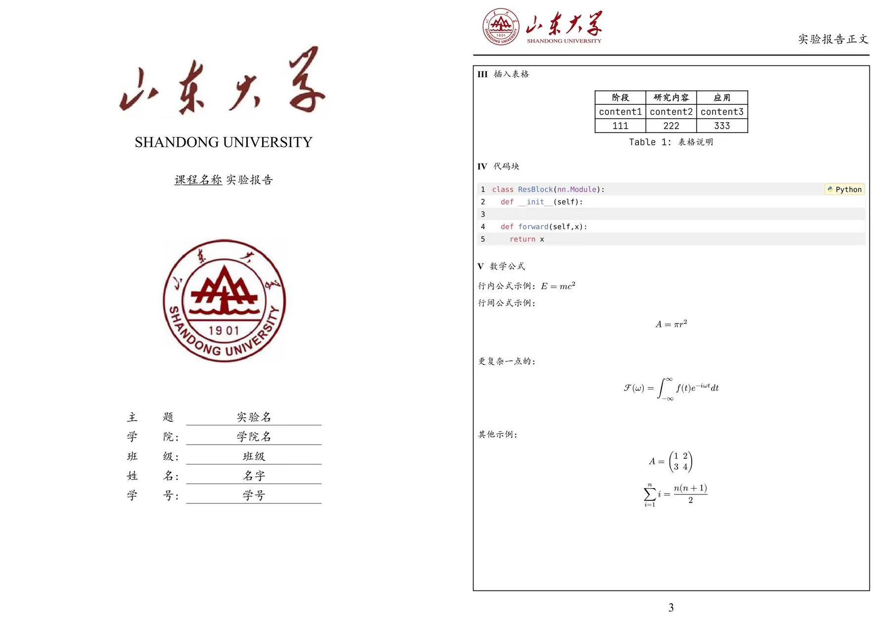

<div align="center">

# Typst 实验报告模板

**告别繁琐排版，把时间留给实验本身。**

一套简洁、现代、开箱即用的中文实验报告模板<br>
专为山东大学课程实验设计

[](https://typst.app/)
[](https://github.com/xmdjy/exp-report-template)
[](./LICENSE)

[快速开始](#-快速开始) · [功能亮点](#-功能亮点) · [查看示例 PDF](./template/main.pdf)

</div>



## ✨ 功能亮点

- **开箱即用的封面**：课程、学院、班级、姓名、学号等信息一处填写
- **统一的报告版式**：自动处理页眉、页脚、页码、标题编号与正文间距
- **丰富的内容组件**：支持图片、表格、数学公式、代码高亮、提示框与重点标注
- **规范的文献引用**：内置 BibTeX 工作流和 GB/T 7714 数字引用样式
- **Typst 极速编译**：语法清晰，实时预览，适合课程作业与实验报告的快速迭代

## 🚀 快速开始

### 方式一：克隆项目（推荐）

确保已经安装 [Typst](https://github.com/typst/typst)；如果使用 VS Code，推荐安装 [Tinymist Typst](https://marketplace.visualstudio.com/items?itemName=myriad-dreamin.tinymist) 扩展，以获得语法高亮、自动补全和实时 PDF 预览。

```bash
git clone https://github.com/xmdjy/exp-report-template.git
cd exp-report-template
typst compile --root . template/main.typ
```

打开 `template/main.typ`，填写封面信息并开始写作：

```typst
#import "../lib.typ": *

#showpage(
  course: "课程名称",
  college: "学院名称",
  class: "班级",
  author: "姓名",
  stdid: "学号",
  title: "实验名称",
)

#reportpage[
  = 实验目的

  在这里开始撰写你的实验报告。
]
```

### 方式二：作为 Typst 包使用

如果该版本已发布至 Typst Universe，可在项目中直接导入：

```typst
#import "@preview/xmdjy-simple-report-template:0.1.1": *
```

随后使用与上方相同的 `#showpage(...)` 和 `#reportpage[...]` 即可。

## 🧩 常用内容

模板已经配置好常见实验报告元素：

```typst
// 图片
#figure(
  image("../images/example.png", width: 75%),
  caption: [实验流程图],
)

// 三线表
#table(
  columns: (1fr, 2fr, 1fr),
  stroke: none,
  table.hline(stroke: 1.2pt),
  table.header([*阶段*], [*研究内容*], [*应用*]),
  table.hline(stroke: 0.6pt),
  [需求分析], [明确实验目标与约束], [方案设计],
  [实验验证], [记录并分析实验数据], [结果评估],
  table.hline(stroke: 1.2pt),
)

// 数学公式
$ E = m c^2 $

// 提示框
#idea[记录一个关键思路。]
#warning[标注实验中的注意事项。]

// 文献引用
相关工作可参考 @rawles2024androidworlddynamicbenchmarkingenvironment。
#bibliography("ref.bib", style: "gb-7714-2015-numeric", title: "参考文献")
```

代码块会自动启用语法高亮：

````typst
#codly(languages: codly-languages)
```python
def hello_typst():
    print("Hello, Typst!")
```
````

## 📁 项目结构

```text
exp-report-template/
├── assets/                 # 学校标识与模板内置图片素材
├── images/                 # 用户报告中使用的图片资源
├── lib.typ                 # 模板核心样式与排版配置
├── thumbnail.png           # 模板预览图
├── typst.toml              # Typst 包信息
└── template/
    ├── main.typ            # 示例报告与写作入口
    ├── main.pdf            # 编译后的示例 PDF
    └── ref.bib             # BibTeX 参考文献
```

## 🔤 推荐字体

为获得与预览图一致的效果，建议安装：

- Songti SC（中文正文）
- Heiti SC（中文标题）
- Kaiti SC（封面信息）
- Times New Roman（英文正文）
- JetBrains Mono（可选，用于代码块）

[下载 JetBrains Mono](https://www.jetbrains.com/lp/mono/)

## 📌 版本记录

- `0.1.1` — 优化模板细节与依赖包（2026-03-13）
- `0.1.0` — 首个公开版本（2026-02-16）

## 🤝 参与改进

如果模板对你有帮助，欢迎点一个 ⭐ Star。遇到排版问题、希望支持新的报告样式，也欢迎提交 Issue 或 Pull Request。

## 📚 相关资源

- [Typst 官网](https://typst.app/)
- [Typst 中文文档](https://typst-doc-cn.github.io/docs/)
- [Typst 中文教程“小蓝书”](https://typst-doc-cn.github.io/tutorial/)
- [南京大学：并不复杂的 Typst 讲座](https://www.bilibili.com/video/BV1AJ4m1j7Sa)
- [上海交通大学本科生毕业设计中期检查报告模板](https://github.com/zh1-z/SJTU-Bachelor-Thesis-Midterm-Typst-Template)

<div align="center">

**写得更快，排得更好。**

Made with Typst · Released under the [MIT License](./LICENSE)

</div>
